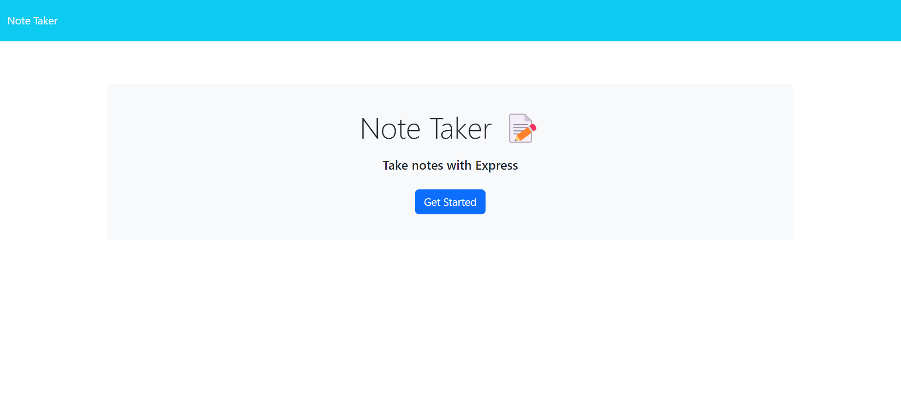
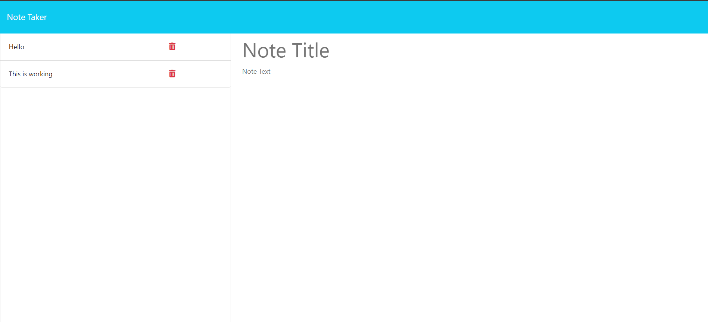

# note-taking-express.js-challenge-11

## Description

The reason for this project was to use expess.js to help create a note taking application. This application allows the user to create, save and delete notes. On startup the user is prompted with a "get started" button. The user can click the button and will be directed to the main page for note taking. Once user is done with the notes they can click the save button and it'll populate on the left side of the screen. These notes will be saved and can be reference for future use and it can be deleted after.

## Usage

deployed link: https://dameine.github.io/note-taking-challenge-11/

github repo: https://github.com/Dameine/note-taking-challenge-11

## Screenshots

